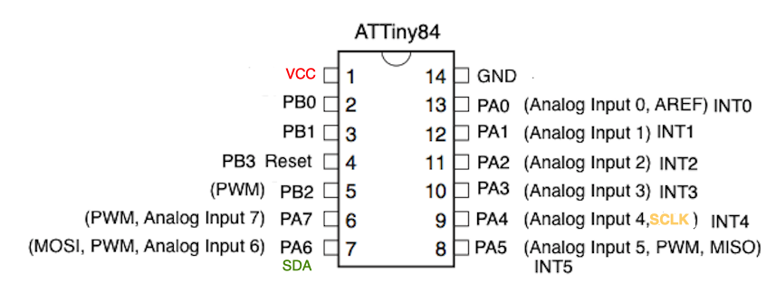
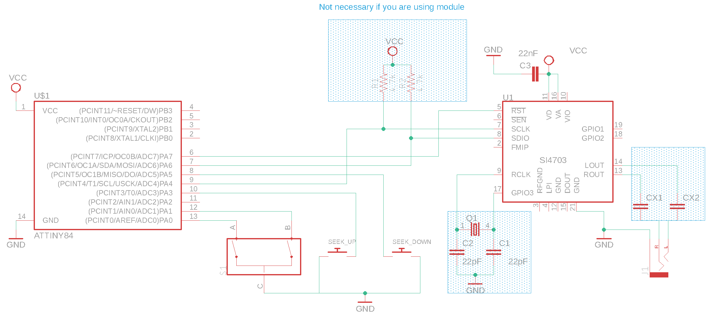
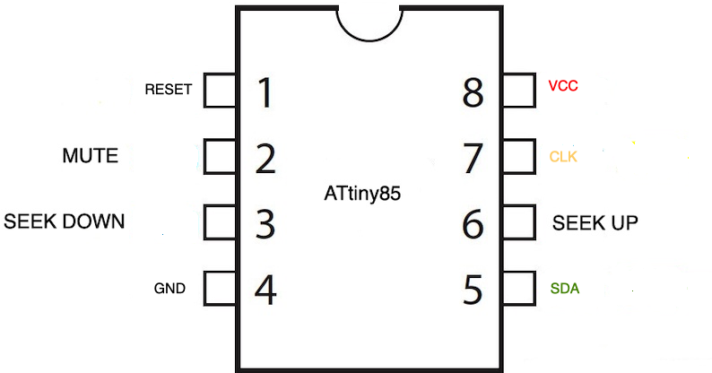
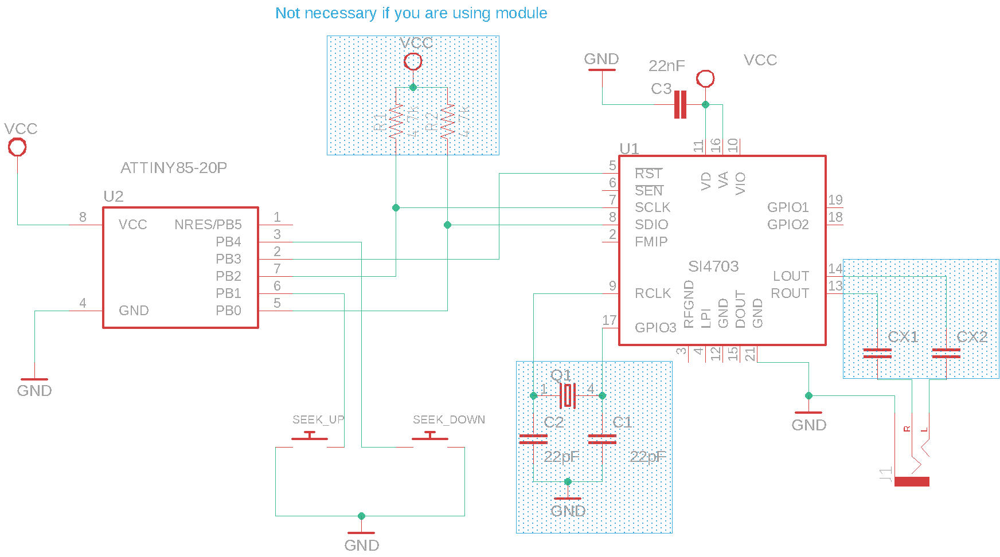

# ATTiny84 and ATTiny85 setup

It is possible to use the Arduino IDE platform with the PU2CLR SI470X Arduino Library to implement receivers with the ATTiny84 and ATTiny85. You will find details on how to do this below.

## Arduino IDE setup

* Open the Arduino IDE on your computer.
* Go to the "File" menu and select "Preferences".
* In the Preferences window, look for the "Additional Boards Manager URLs" field and click on the icon to edit it.
* Add the following URL to the field: [http://drazzy.com/package_drazzy.com_index.json](http://drazzy.com/package_drazzy.com_index.json)
* Click "OK" to close the Preferences window.
* Next, go to the "Tools" menu and select "Board" -> "Boards Manager".
* In the Boards Manager, type "attiny" in the search bar.
* Look for "ATTinyCore by Spence Konde" and click on the "Install" button next to it.
* Wait for the installation to complete.
* Once installed, you can close the Boards Manager.
* Now, go to the "Tools" menu and select "Board". You should see a new "ATTinyCore" section.
* Select the appropriate ATtiny microcontroller you are using, along with the desired clock speed and other options.
* You are now ready to program and use ATtiny microcontrollers with the Arduino IDE using the AttinyCore.
* Please note that the specific steps and menu options may vary slightly depending on the version of the Arduino IDE you are using.

[More details](https://github.com/SpenceKonde/ATTinyCore)

## Programming Interface (USBAsp 6 pin)

The table below shows the pin functions of the ATTiny84 and ATTiny85  needed to upload sketch via USBAsp interface.

| Function / USBAsp   | ATTiny85 Pin |  ATTiny84 Pin | 
| ------------------- | ------------ | ------------- |
| RESET               | 1 (PB5)      | 4 (PB3)       |   
| MOSI                | 5 (PB0)      | 7 (PA6)       |
| MISO                | 6 (PB1)      | 8 (PA5)       |
| SCK                 | 7 (PB2)      | 9 (PA4)       |
| GND                 | 4            | 14            |
| VCC                 | 8            | 1             |

## ATTiny84 wireup

| SI4703 pin      | ATTiny84 REF pin | Physical pin  | 
| ----------------| -----------------| ------------- | 
| SEEK_UP         |     3            |    10         | 
| SEEK_DOWN       |     5            |     8         |
| ENCODER_PIN_A   |     0            |    13         |
| ENCODER_PIN_B   |     1            |    12         |  
| SDIO / SDA      |     SDA          |     7         |
| SCLK / CLK      |     SCL          |     9         |
| RESET /RST      |     7            |     6         |

### ATTiny84 pinout

### ATTiny84 schematic

## ATTiny85 and SI4703 wireup  

| SI4703 pin    | ATTiny85 REF pin | Physical pin  | 
| --------------| -----------------| ------------- | 
| SEEK_UP       |     PB1          |     6         | 
| SEEK_DOWN     |     PB4          |     3         |
| RESET / RST   |     PB3          |     2         | 
| SDIO / SDA    |     SDA          |     5         |
| SCLK / CLK    |     SCL          |     7         |
   
 

## ATTiny85 pinout

## ATTiny85 schematic

